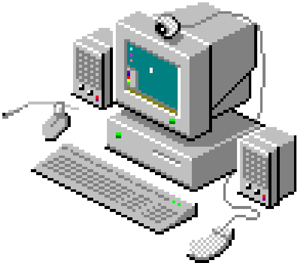

  
  Welcome to Sanjay Gaire's GitHub
  

# Hey! I'm Sanjay.
## I ***TRY*** to build different applications through the use of programming.

        ■ Web and Mobile  ■ AI/ML ■ Automata ■ AI Experiments ■ Writing and Creative works

▮ I work on things I enjoy and love breaking complex stuff into simple parts. ▮ 

## 🛠️ Skills

- 💻 Languages: Python, C, C++, HTML, CSS, JavaScript (basic)
- 🌐 Frameworks: Django, Django REST Framework, React (basic)
- 🖼️ Tools: Git, VS Code, Postman, Pygame, Docker

---

## 📚 Currently Learning

- 🔍 Machine Learning with Scikit-learn
- 🧱 Full-Stack with Django + React
- ⚙️ Celery, Redis, Task Queues
- 🖥️ Basics of Computer Architecture
---

### 📫 Contact
- **Email**: gairesanjay59@gmail.com  

  

