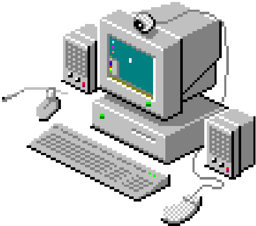

  
  Welcome to Sanjay Gaire's GitHub
  

# Hey! I'm Sanjay.
## I ***TRY*** to build different applications through the use of programming.

        ■ Web    ■ Mobile  ■ AI/ML   ■ Writing and Creative works

▮ I work on things I enjoy breaking complex stuff into simple parts. ▮ 

## 🛠️ Skills

- 💻 Languages: Python, C, C++, HTML, CSS, JavaScript
- 🌐 Frameworks: Django, Django REST Framework, React , ReactNative(Expo)
- 🖼️ Tools: Git, VS Code, Postman, Pygame

---

## 📚 Currently Learning

- Django
- ReactNative
- AI/ML
---

### 📫 Contact
- **Email**: gairesanjay59@gmail.com  

  

